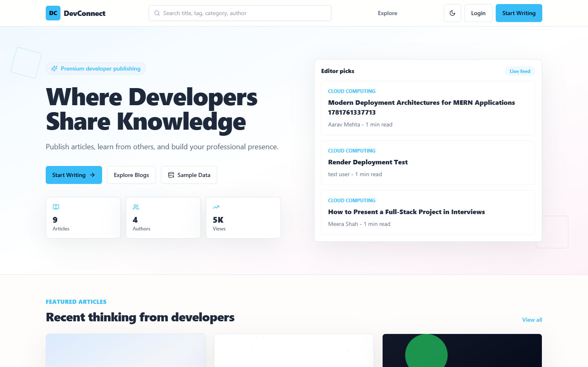
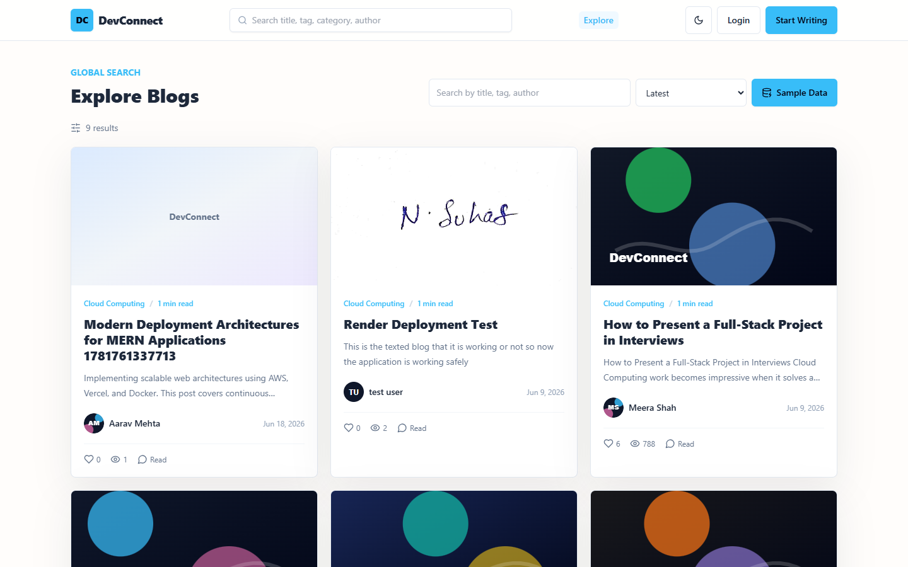
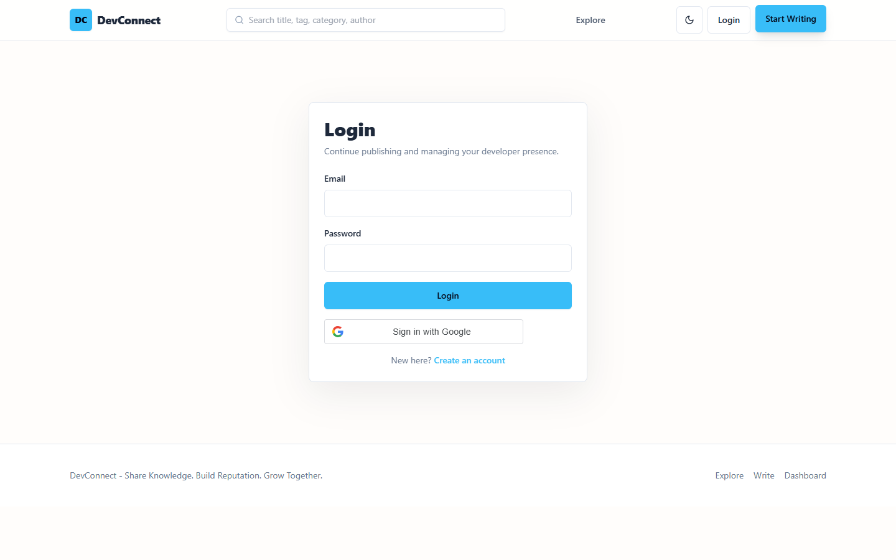
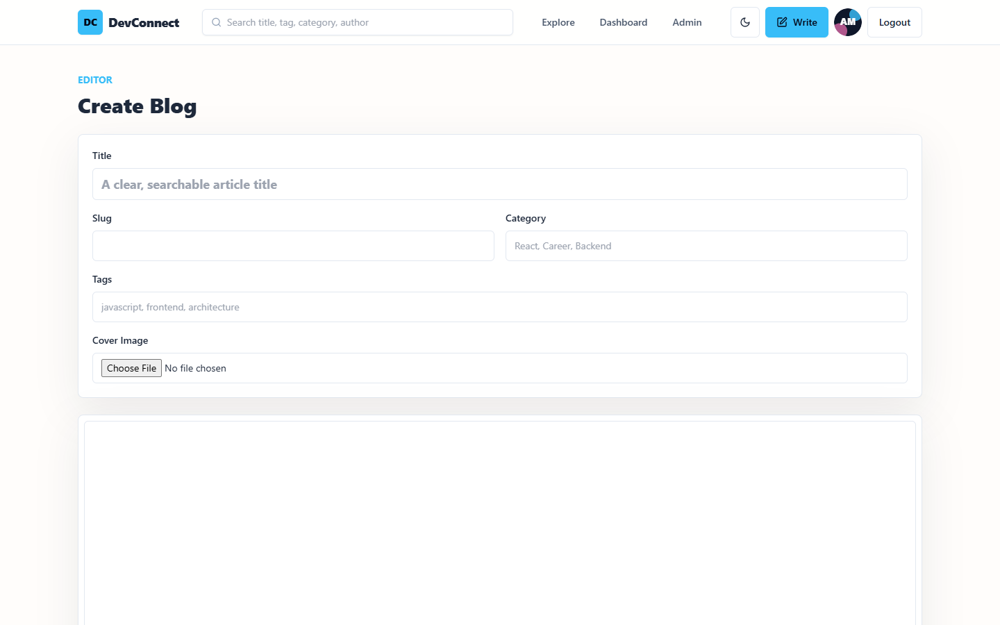
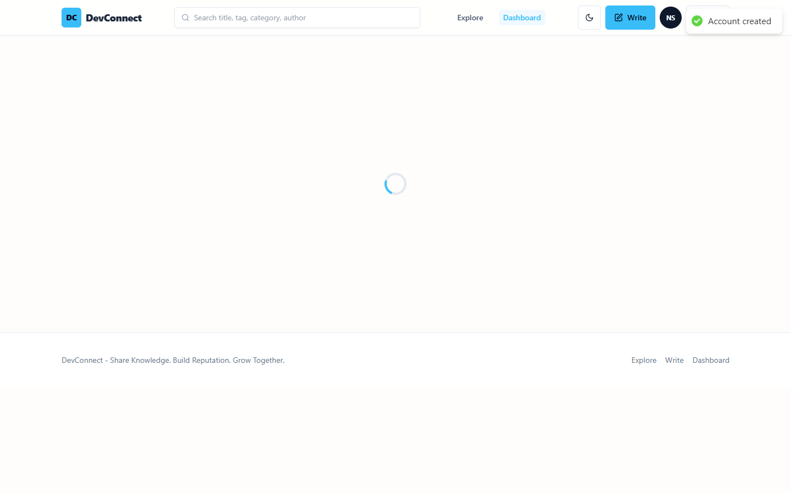
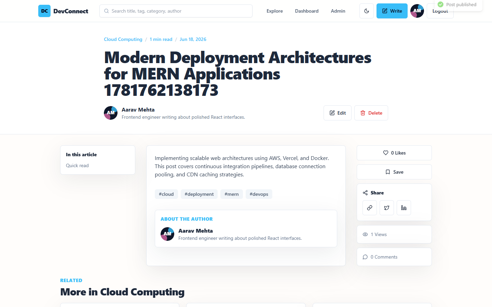
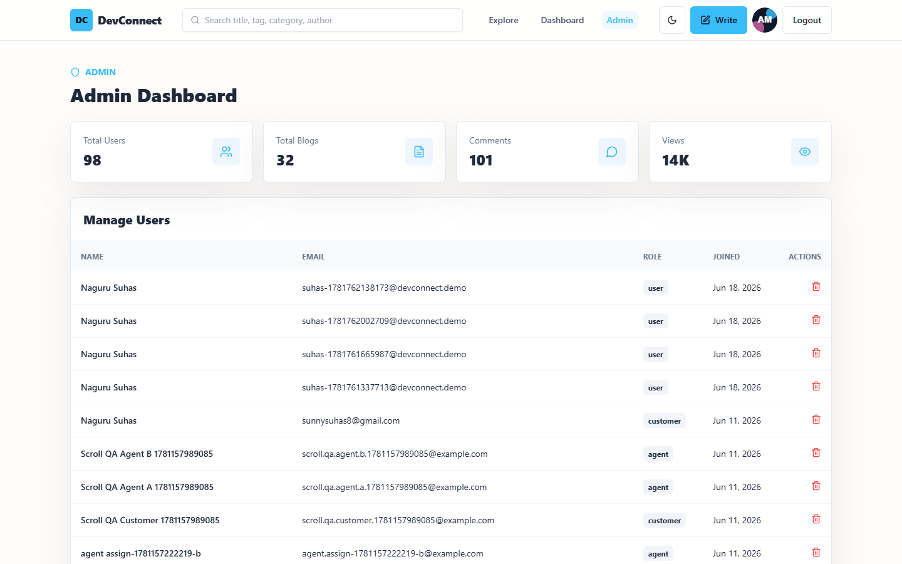
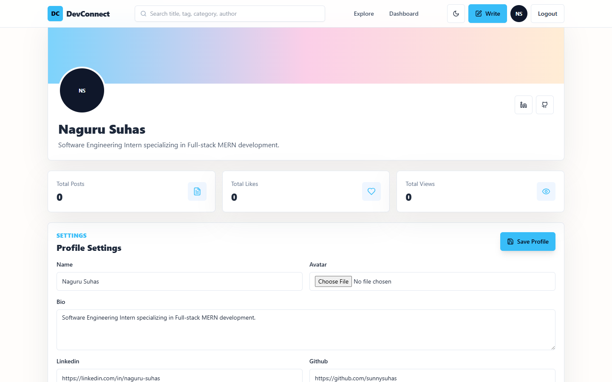
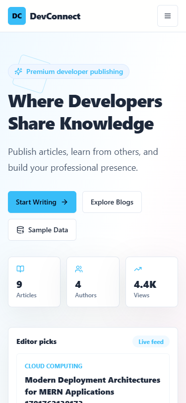
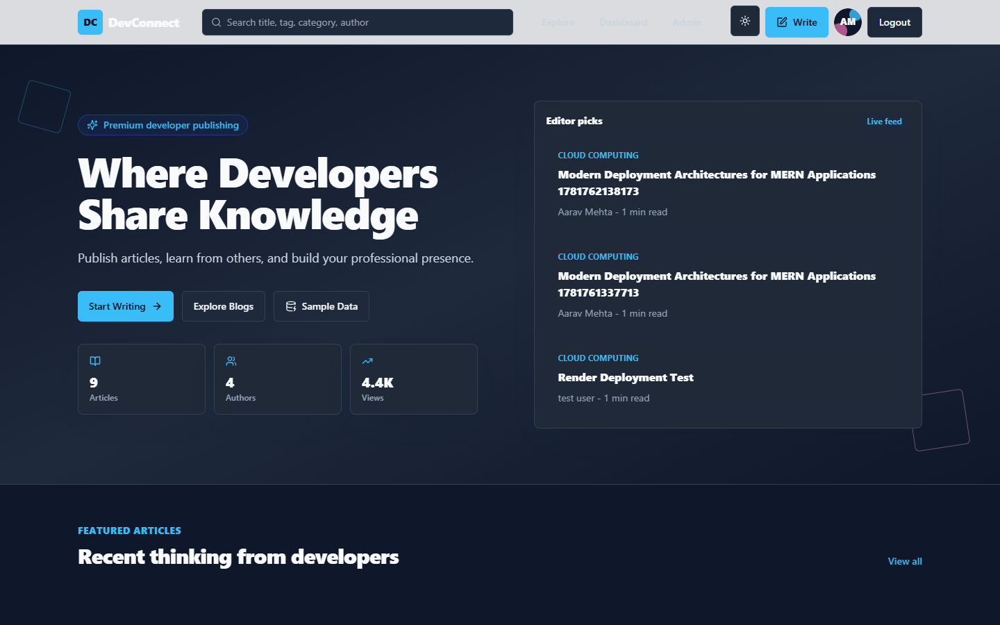

# DevConnect – Full Stack Developer Blog

DevConnect is a premium, developer-focused MERN Stack blogging platform inspired by Dev.to, Medium, and modern SaaS dashboards. It enables developers to share knowledge, build reputation, and grow together in a secure, performant ecosystem.

---

## 🎓 Internship Submission Details

* **Organization:** Codtech IT Solutions Private Limited
* **Intern ID:** CITS1983
* **Full Name:** Sai Pranavi
* **Duration:** 8 Weeks
* **Domain:** Full Stack Web Development
* **Live Application:** [https://dev-connect-blush.vercel.app](https://dev-connect-blush.vercel.app)
* **GitHub Repository:** [https://github.com/sunnysuhas/DevConnect](https://github.com/sunnysuhas/DevConnect)

---

## 📌 Project Scope

DevConnect is designed to address the unique formatting and social requirements of the software engineering community. It bridges the gap between raw markdown writing and responsive community engagement. The scope includes:
1. **Secure Access Management:** Complete JWT-based registration/login flows and modern Google OAuth login integration.
2. **Interactive Content Authoring:** A rich-text editor (Quill-based) that handles sanitization, media embedding, custom tags, auto-read-time estimation, and drafts vs. publishing states.
3. **Community & Engagement:** Deep nesting of comments, likes, and dashboard-integrated bookmarking.
4. **Platform Administration:** Admin dashboards displaying aggregated metrics (views, users, blogs) and offering moderation features (deleting posts, removing users).
5. **Global Delivery & Performance:** CDN-driven image uploading via Cloudinary and edge deployments on Render and Vercel.

---

## 🚀 Features

- **Double-Layer Authentication:** Custom JWT email/password authentication (with password hashing using bcryptjs) and seamless Google OAuth integration.
- **Role-Based Access Control (RBAC):** Distinct permissions and page routing for Guest, User, and Admin accounts.
- **Rich Text Editor:** WYSIWYG Quill editor supporting header formats, blockquotes, lists, code snippets, drafts saving, and publishing toggle.
- **SEO & Metadata Optimization:** Auto-generated slugs, reading time calculation, cover image uploads, tags, and categories.
- **Social Interactions:** Instant post likes, recursive nested comments/replies, and bookmarks to save posts to the user's dashboard.
- **Admin Dashboard Console:** System-wide user administration, totals dashboard analytics (views, posts, registered users), and comment/blog moderation.
- **Interactive UI/UX:** Built-in dark mode support, glassmorphism header navigation, mobile responsive layouts, page transitions (via Framer Motion), and micro-animations.
- **Robust Security Policies:** Protection against XSS injection via backend HTML sanitization, Express rate-limiting, and Helmet security headers.

---

## 🛠 Tech Stack

* **Frontend:** React.js (v18), Vite, Tailwind CSS, React Router (v6), Axios, React Quill, Lucide Icons, Framer Motion, React Hot Toast, Context API
* **Backend:** Node.js, Express.js, MongoDB Atlas (Mongoose), JWT, bcryptjs, Google Auth Library, Cloudinary, Multer, Express-Mongo-Sanitize, Helmet, HPP
* **Deployment:** Vercel (Frontend Hosting), Render (Backend Hosting), Cloudinary (Media Assets storage), MongoDB Atlas (Database Cluster)

---

## 📂 Repository Organization

```text
devconnect/
├── client/                     # React Frontend Single Page Application
│   ├── src/
│   │   ├── components/         # UI Elements (Navbar, Footer, BlogCard)
│   │   ├── context/            # AuthContext and ThemeContext
│   │   ├── layouts/            # Page structures and ProtectedRoutes
│   │   └── pages/              # Routed Views (Home, Dashboard, Admin)
├── server/                     # Express RESTful API Backend
│   ├── config/                 # DB and Cloudinary connection configs
│   ├── controllers/            # API endpoints controllers
│   ├── middleware/             # Role guards, JWT authorization checking
│   └── models/                 # Database schemas (User, Post, Comment)
├── screenshots/                # Application UI capture displays
├── output-images/              # Transaction success proofs
├── documentation/              # Technical PDF report
├── README.md                   # Main Project Guide
├── DEPLOYMENT.md               # Step-by-step Hosting Instructions
└── SUBMISSION_CHECKLIST.md     # Audit checklist and readiness status
```

---

## 💻 Installation & Setup

### 1. Root Tooling Setup
Install root dependencies:
```bash
npm install
```

### 2. Client & Server Dependency Installation
Install client and server dependencies recursively:
```bash
npm run install:all
```

### 3. Setup Environment Files
Copy the templates to initialize local configurations:
```bash
cp server/.env.example server/.env
cp client/.env.example client/.env
```
Fill in the MongoDB Atlas URI, JWT secret key, Google Client ID, and Cloudinary keys as described below.

### 4. Run Locally
Launch both front-end and backend servers concurrently:
```bash
npm run dev
```
* **Frontend:** [http://localhost:5173](http://localhost:5173)
* **Backend API:** [http://localhost:5000](http://localhost:5000)

---

## 🔑 Environment Variables

### Backend Configuration (`server/.env`)
```env
NODE_ENV=development
PORT=5000
MONGO_URI=mongodb+srv://<username>:<password>@cluster.mongodb.net/devconnect
JWT_SECRET=replace_with_a_long_random_secret_string
JWT_EXPIRES_IN=7d
CLIENT_URL=http://localhost:5173
GOOGLE_CLIENT_ID=your_google_oauth_client_id
CLOUDINARY_CLOUD_NAME=your_cloudinary_cloud_name
CLOUDINARY_API_KEY=your_cloudinary_api_key
CLOUDINARY_API_SECRET=your_cloudinary_api_secret
```

### Frontend Configuration (`client/.env`)
```env
VITE_API_URL=http://localhost:5000/api
VITE_GOOGLE_CLIENT_ID=your_google_oauth_client_id
```

---

## 🔌 API Endpoints

### Authentication
* `POST /api/auth/register` - Registers a new user.
* `POST /api/auth/login` - Authenticates user credentials, returns a JWT.
* `POST /api/auth/google` - Exchanges a Google credential token for a JWT session.
* `GET /api/auth/me` - Resolves active session profile information.
* `POST /api/auth/logout` - Terminates session, clears cookies.

### Users & Profiles
* `GET /api/users/profile` - Retrieves active profile details.
* `PUT /api/users/profile` - Modifies profile details (bio, socials, avatar).
* `GET /api/users/dashboard` - Loads user posts, drafts, and bookmarks.
* `GET /api/users/:id` - Resolves public profile stats of a writer.

### Blogs & Editing
* `GET /api/posts` - Resolves list of posts (supports search, sort, category filter).
* `GET /api/posts/:id` - Resolves individual post by ID or slug.
* `POST /api/posts` - Creates a new post (handles Cover image upload to Cloudinary).
* `PUT /api/posts/:id` - Modifies an existing post.
* `DELETE /api/posts/:id` - Deletes a post.

### Socials
* `POST /api/comments` - Adds a comment or recursive reply to a post.
* `GET /api/comments/:postId` - Resolves list of comments for an article.
* `DELETE /api/comments/:id` - Deletes a comment (available to comment owner or admin).
* `POST /api/likes/:postId` - Toggles article likes.
* `POST /api/bookmarks/:postId` - Toggles article bookmarks.

### Administrative Controls (Admin Only)
* `GET /api/admin/users` - Resolves list of all platform users.
* `GET /api/admin/analytics` - Resolves platform counters (total users, posts, views).
* `DELETE /api/admin/user/:id` - Administratively deletes a user and their blogs.
* `DELETE /api/admin/post/:id` - Administratively deletes a violating post.

### Seed Utility
* `POST /api/seed/demo` - Seeds database with clean, default developer posts.
* `POST /api/seed/demo?reset=true` - Clears database and reseeds with fresh demo posts.

---

## 📦 Deployment Guide

Refer to [DEPLOYMENT.md](DEPLOYMENT.md) for full instructions on configuring Vercel edge deployment, Render web services, MongoDB Atlas, and Cloudinary keys.

---

## 📸 Screenshots

Here are the key user interfaces of the DevConnect platform captured using professional demo data:

| | |
| :---: | :---: |
| **Homepage Interface** | **Explore (Search Filters)** |
|  |  |
| **Secure Authentication** | **Rich-Text Post Composer** |
|  |  |
| **Dashboard Controls** | **Blog Article View** |
|  |  |
| **Admin Analytics Panel** | **User Profile Card** |
|  |  |
| **Mobile Navigation Responsive** | **Premium Dark Mode Toggle** |
|  |  |

---

## 🌟 Output Success Proofs

Below are captured action states displaying success alerts, validation prompts, and interactive feedback:

* **Registration Success Toast:** `output-images/registration-success.png`
* **Login Authentication Success:** `output-images/login-success.png`
* **Blog Post Creation Success:** `output-images/blog-creation-success.png`
* **Blog Post Publishing Success:** `output-images/blog-publishing-success.png`
* **Comments Added successfully:** `output-images/comment-added.png`
* **Like Counter Increment:** `output-images/like-added.png`
* **Bookmarked Post State:** `output-images/bookmark-added.png`
* **User Profile Updated Toast:** `output-images/profile-updated.png`
* **Admin Statistics Count Update:** `output-images/admin-analytics.png`

---

## 📄 Documentation

* **Technical PDF Report:** [Project_Documentation.pdf](documentation/Project_Documentation.pdf) - Includes comprehensive cover page, systems architecture block, database design entity breakdowns, API endpoint layouts, security details, and future scope.
* **Submission Checklist Audit:** [SUBMISSION_CHECKLIST.md](SUBMISSION_CHECKLIST.md) - A full verification review outlining compliance checks and readiness score.
